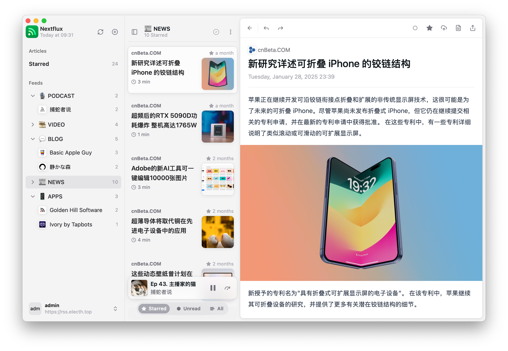

# Reactflux

A modern RSS reader client for Miniflux built with React + Vite.

## ✨ Features

- 🚀 Fast and responsive UI built with NextUI
- 🌐 Connect to your Miniflux server
- 🔄 Automatic background sync with configurable intervals
- 📱 Mobile-friendly with PWA support
- 🌙 Light/Dark mode with multiple theme options
- 🌍 i18n support (English & Chinese)
- 👀 Mark as read on scroll
- 🎯 Rich reading experience
    - Custom font settings
    - Image gallery with touch gestures support
    - Podcast support
    - Video player support
- ⌨️ Keyboard shortcuts
- 📊 Feed management
    - OPML import
    - Category organization
    - Feed hiding

## 📸 Screenshot Galleries

<table>
    <tr>
        <td>Podcast
        </td>
        <td>YouTube
        </td>
    </tr>
    <tr>
        <td></td>
        <td></td>
    </tr>
    <tr>
        <td>Code Highlight
        </td>
        <td>Image Gallery
        </td>
    </tr>
    <tr>
        <td></td>
        <td></td>
    </tr>
     <tr>
        <td>Feed Management
        </td>
        <td>General Settings
        </td>
    </tr>
    <tr>
        <td></td>
        <td></td>
    </tr>
    <tr>
      <td>Appearance
      </td>
      <td>Reading
      </td>
    </tr>
    <tr>
        <td></td>
        <td></td>
    </tr>
    <tr>
        <td>Stone theme
        </td>
        <td>Responsive
        </td>
    </tr>
    <tr>
        <td></td>
        <td></td>
    </tr>
    <tr>
        <td>Search
        </td>
        <td>Dark Mode
        </td>
    </tr>
    <tr>
        <td></td>
        <td></td>
    </tr>
    <tr>
        <td>Mobile
        </td>
        <td>Windows
        </td>
    </tr>
    <tr>
        <td></td>
        <td></td>
    </tr>
</table>

## 🛠️ Tech Stack

- React 18
- Vite
- TailwindCSS
- NextUI
- i18next
- IndexedDB
- Nanostores
- DayJS

## 📝 Configuration

The app requires a Miniflux server to function. You'll need to provide:

- Server URL
- Username
- Password

## 🌍 Browser Support

- Chrome (recommended)
- Firefox
- Safari
- Edge

## 📱 Mobile Support

The app is fully responsive and works well on mobile devices. It can also be installed as a PWA for a native app-like
experience.

## 🤝 Contributing

Contributions are welcome! Please feel free to submit a Pull Request.

## 📄 License

This project is licensed under the MIT License - see the LICENSE file for details.